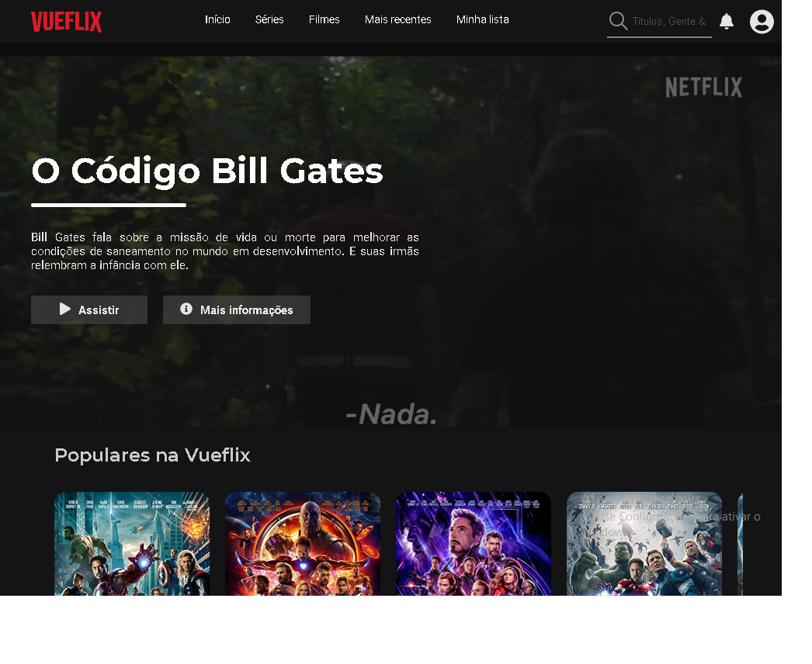

# Vueflix

  

# About this Project
This project is Netflix simple clone built with Vuejs

[Based on Ricardo Vasconcelos' project](https://github.com/ricardovasconcelos)

# Features

- :heavy_check_mark: **Vue Js** — A JavaScript library for building user interfaces
- 🎞 **OmdbAPI** — The Open Movie Database

## Getting started

1. Clone this repo using `git clone git@github.com:thallesyasmim/Vueflix-Thalles.git`
2. Move yourself to the appropriate directory: `cd vueflix-thalles` 
3. Run `npm install` to install dependencies 

### Getting started with the project

1. Add the `movieAPI KEY` in trailer file
  - Get your api key here `http://www.omdbapi.com`
2. Run `npm run serve` to start the web application on `localhost:8080`

<h2>📱 Minhas redes sociais:</h2>

   
    
      
  
    
    
   
  
  
 

<h4>Feito com ❤ por Thalles Gabriel 🔥 </h4>

